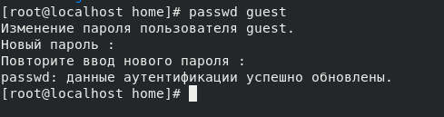
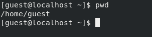
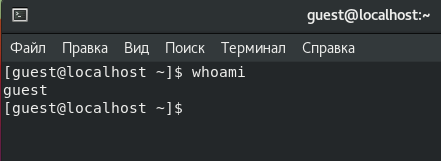
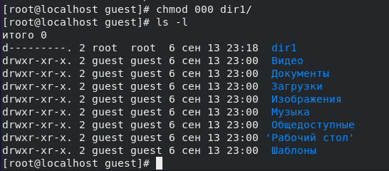
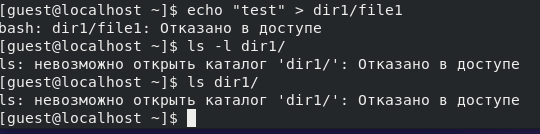

---
# Front matter
title: "Шаблон отчёта по лабораторной работе"
subtitle: ""
author: "Турсунов Баходурхон Азимджонович"

# Generic otions
lang: ru-RU
toc-title: "Содержание"

# Bibliography
bibliography: bib/cite.bib
csl: pandoc/csl/gost-r-7-0-5-2008-numeric.csl

# Pdf output format
toc: true # Table of contents
toc_depth: 2
lof: true # List of figures
lot: true # List of tables
fontsize: 12pt
linestretch: 1.5
papersize: a4
documentclass: scrreprt
## I18n
polyglossia-lang:
  name: russian
  options:
	- spelling=modern
	- babelshorthands=true
polyglossia-otherlangs:
  name: english
### Fonts
mainfont: PT Serif
romanfont: PT Serif
sansfont: PT Sans
monofont: PT Mono
mainfontoptions: Ligatures=TeX
romanfontoptions: Ligatures=TeX
sansfontoptions: Ligatures=TeX,Scale=MatchLowercase
monofontoptions: Scale=MatchLowercase,Scale=0.9
## Biblatex
biblatex: true
biblio-style: "gost-numeric"
biblatexoptions:
  - parentracker=true
  - backend=biber
  - hyperref=auto
  - language=auto
  - autolang=other*
  - citestyle=gost-numeric
## Misc options
indent: true
header-includes:
  - \linepenalty=10 # the penalty added to the badness of each line within a paragraph (no associated penalty node) Increasing the value makes tex try to have fewer lines in the paragraph.
  - \interlinepenalty=0 # value of the penalty (node) added after each line of a paragraph.
  - \hyphenpenalty=50 # the penalty for line breaking at an automatically inserted hyphen
  - \exhyphenpenalty=50 # the penalty for line breaking at an explicit hyphen
  - \binoppenalty=700 # the penalty for breaking a line at a binary operator
  - \relpenalty=500 # the penalty for breaking a line at a relation
  - \clubpenalty=150 # extra penalty for breaking after first line of a paragraph
  - \widowpenalty=150 # extra penalty for breaking before last line of a paragraph
  - \displaywidowpenalty=50 # extra penalty for breaking before last line before a display math
  - \brokenpenalty=100 # extra penalty for page breaking after a hyphenated line
  - \predisplaypenalty=10000 # penalty for breaking before a display
  - \postdisplaypenalty=0 # penalty for breaking after a display
  - \floatingpenalty = 20000 # penalty for splitting an insertion (can only be split footnote in standard LaTeX)
  - \raggedbottom # or \flushbottom
  - \usepackage{float} # keep figures where there are in the text
  - \floatplacement{figure}{H} # keep figures where there are in the text
---

# Выполнение 2 лабораторной работы

## Дискреционное разграничение прав в Linux. Основные атрибуты

### Цель работы 

 - Получение практических навыков работы в консоли с атрибутами файлов, закрепление теоретических основ дискреционного разграничения доступа в современных системах с открытым кодом на базе OC Linux

#### Порядок выполнения работы

1. В установленной при выполнении лабораторной работы, создал учётную запись пользователя guest (используя учётную запись администратора)

{ #fig:001 width=70% height=70% }

2. Задал пароль для пользователя guest (используя учётную запись администратора)

{ #fig:002 width=70% height=70% }

3. Вошел в систему от имени пользователя guest

4. Определил директорию, в котором нахожусь командой pwd. Сравнил приглашение командной строки, и определил, что нахожусь в домашнем каталоге.

{ #fig:003 width=70% height=70% }

5. Уточнил имя моего пользователя командой <b>whoami</b>

{ #fig:004 width=70% height=70% }

6. Уточнил имя моего пользователя, его группу, а также группы, куда входит пользователь, командой <b>id</b>. 

{ #fig:005 width=70% height=70% }

7. Сравнил полученную информацию об имени пользователя с данными, выводимыми в приглашении командной строки.

8. Посмотрел файл <b>/etc/passwd/</b> командой <b>cat /etc/passwd/</b>

{ #fig:006 width=70% height=70% }

 - Нашел в нем созданную учётную запись. Определил uid пользователя: <b>1001</b>, gid пользователя <b>1001</b>. 
 - Наши значения при сравнении с 6 пунктом отличаются, потому что в 6 пункте uid и gid пользователя равны 0, а в 8 пункте при вводе команды <b>cat /etc/passwd/</b> значения равны <b>1001</b>. 

9. Определил существующие в системе директории командой <b>ls -l /home/</b> и получил список поддиректорий директорий <b>/home</b> и установлены <b>все права</b>, для пользователей.

{ #fig:007 width=70% height=70% }

10. Проверил какие расширенные атрибуты установлены на поддиректориях, находящихся в директории <b>/home</b> командой <b>lsattr /home</b>

{ #fig:008 width=70% height=70% }

 - Удалось увидеть расширенные атрибуты директорий, и директорий  других пользователей, они не <b>установлены</b>

11. Создал в домашней директории поддиректорию <b>dir1</b> командой <b>mkdir dir1</b>

{ #fig:009 width=70% height=70% }

 - Мы видим, что установлены <b>rwx - все права</b> для пользователя, <b>r-x только чтение и выполнение, без права на запись</b> для группы и остальных. Т.е. все могут читать этот каталог, но его содержимое может изменить только владелец

12. Снял с директории <b>dir1</b> все атрибуты командой <b>chmod 000 dir1</b> и проверил с её помощью правильность выполнения команды <b>ls -l</b> и видим, что все атрибуты с директории сняты.

{ #fig:010 width=70% height=70% }

13. Попытался создать в директории <d>dir1</d> <b>file1</b> командой <b>echo "test" > dir1/file1</b> и получил отказ в выполнении операции, потому что прав, ни на что, у моего пользователя не было.

{ #fig:011 width=70% height=70% }

# Вывод 

 - В этой лабораторной работе получил практический навык работы в консоли с атрибутами файлов, закрепил теоретические основы дискреционного разграничения доступа в современных системах с открытым кодом на базе OC Linux.
