---
# Front matter
title: "Отчёт лабораторной работы 5"
subtitle: "Дискреционное разграничение прав в Linux. Исследование влияния дополнительных атрибутов"
author: "Турсунов Баходурхон Азимджонович"

# Generic otions
lang: ru-RU
toc-title: "Содержание"

# Bibliography
bibliography: bib/cite.bib
csl: pandoc/csl/gost-r-7-0-5-2008-numeric.csl

# Pdf output format
toc: true # Table of contents
toc_depth: 2
lof: true # List of figures
lot: true # List of tables
fontsize: 12pt
linestretch: 1.5
papersize: a4
documentclass: scrreprt
## I18n
polyglossia-lang:
  name: russian
  options:
	- spelling=modern
	- babelshorthands=true
polyglossia-otherlangs:
  name: english
### Fonts
mainfont: PT Serif
romanfont: PT Serif
sansfont: PT Sans
monofont: PT Mono
mainfontoptions: Ligatures=TeX
romanfontoptions: Ligatures=TeX
sansfontoptions: Ligatures=TeX,Scale=MatchLowercase
monofontoptions: Scale=MatchLowercase,Scale=0.9
## Biblatex
biblatex: true
biblio-style: "gost-numeric"
biblatexoptions:
  - parentracker=true
  - backend=biber
  - hyperref=auto
  - language=auto
  - autolang=other*
  - citestyle=gost-numeric
## Misc options
indent: true
header-includes:
  - \linepenalty=10 # the penalty added to the badness of each line within a paragraph (no associated penalty node) Increasing the value makes tex try to have fewer lines in the paragraph.
  - \interlinepenalty=0 # value of the penalty (node) added after each line of a paragraph.
  - \hyphenpenalty=50 # the penalty for line breaking at an automatically inserted hyphen
  - \exhyphenpenalty=50 # the penalty for line breaking at an explicit hyphen
  - \binoppenalty=700 # the penalty for breaking a line at a binary operator
  - \relpenalty=500 # the penalty for breaking a line at a relation
  - \clubpenalty=150 # extra penalty for breaking after first line of a paragraph
  - \widowpenalty=150 # extra penalty for breaking before last line of a paragraph
  - \displaywidowpenalty=50 # extra penalty for breaking before last line before a display math
  - \brokenpenalty=100 # extra penalty for page breaking after a hyphenated line
  - \predisplaypenalty=10000 # penalty for breaking before a display
  - \postdisplaypenalty=0 # penalty for breaking after a display
  - \floatingpenalty = 20000 # penalty for splitting an insertion (can only be split footnote in standard LaTeX)
  - \raggedbottom # or \flushbottom
  - \usepackage{float} # keep figures where there are in the text
  - \floatplacement{figure}{H} # keep figures where there are in the text
---

# Цель работы 

 - Изучение механизмов изменения идентификаторов, применения SetUID- и Sticky-битов. Получение практических навыков работы в консоли с дополнительными атрибутами. Рассмотрение работы механизма смены идентификатора процессов пользователей, а также влияние бита Sticky на запись и удаление файлов.  

## 2.1 Подготовка лабораторного стенда 

1. С помощью команды gcc -v проверил, установлен ли компилятор gcc в моей системе, как оказалось не установлен

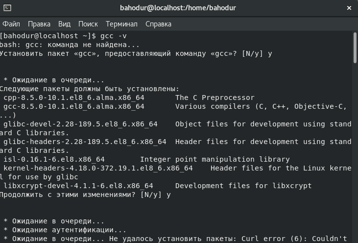{ #fig:001 width=70% height=70% }

2. После установления компилятора gcc с помощью команды gcc -v узнаем подробности и версию нашего компилятора, затем отключил систему запретов до очередной перезагрузки системы командой setenforce 0, после этого команда getenforce вывела Permissive.

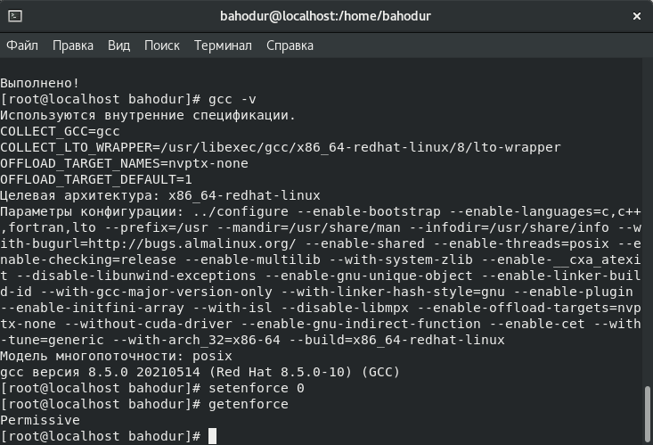{ #fig:002 width=70% height=70% }

## 2.2 Изучение механики SetUID

1. Вошел в систему от имени пользователя guest

2. Написал программу simpleid.c

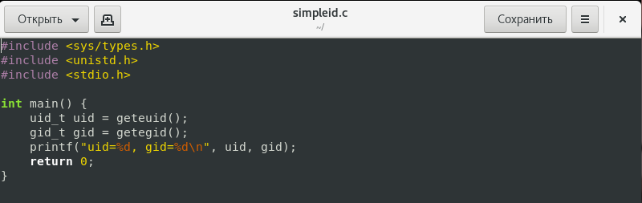{ #fig:003 width=70% height=70% }

3. Скомпилировал программу и убедился, что файл программы создан с помощью команды gcc simpleid.c -o simpleid

4. Далее выполнил программу simpleid командой ./simpleid

5. Выполнил системную программу id с помощью команды id. uid и gid совпадает в обеих программах

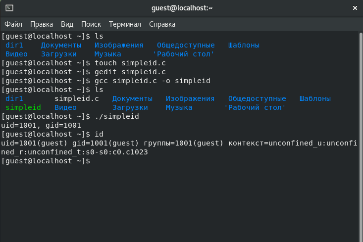{ #fig:004 width=70% height=70% }

6. Усложнил программу, добавив вывод действительных идентификаторов

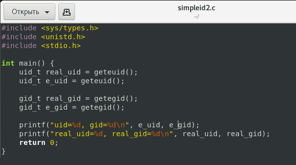{ #fig:005 width=70% height=70% }

7. Далее скомпилировал и запустил simpleid2.c и от имени суперпользователя выполнил команды chown и chmod u+s и выполнил проверку правильности установки новых атрибутов и имени владельца файла 

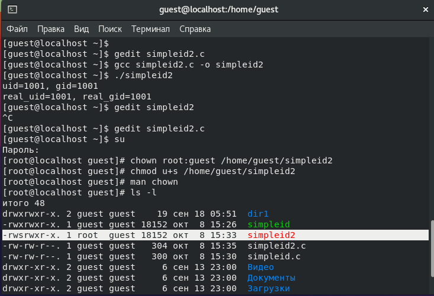{ #fig:006 width=70% height=70% }

8. Написал программу readfile.c 

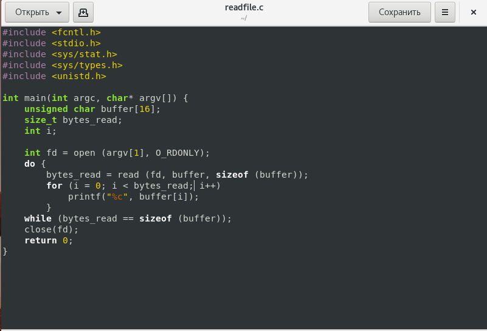{ #fig:007 width=70% height=70% }

9. Скомпилировал файл

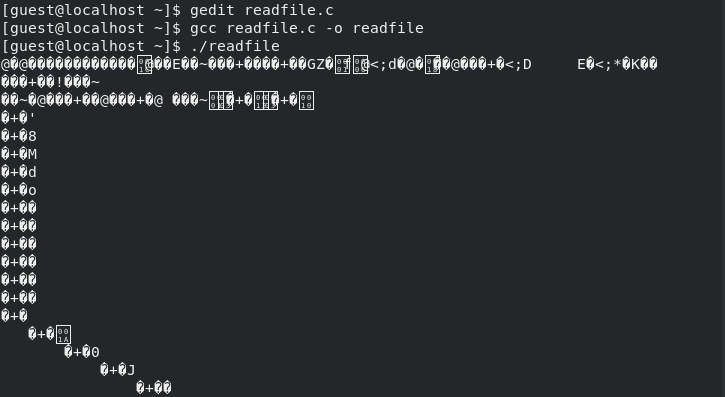{ #fig:008 width=70% height=70% }

10. Сменил владельца у файла и изменил права так, чтобы только суперпользователь мог прочитать его, а guest не мог. И проверил что пользователю отказано в доступе и он не может прочитать файл.

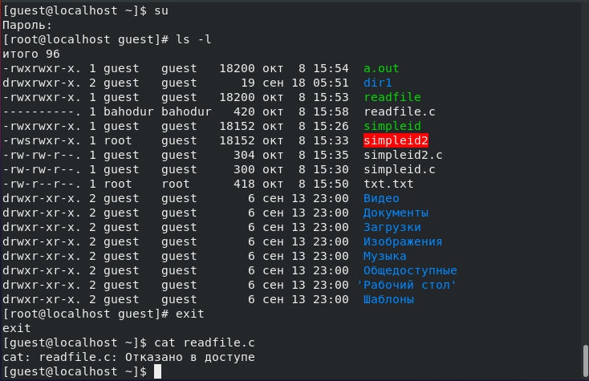{ #fig:009 width=70% height=70% }

## 2.3 Исследование Sticky-бита

1. Выяснил, установлен ли атрибут Sticky на директории /tmp.

2. От имени пользователя guest создал файл file01.txt в директории /tmp со словом test.

3. Просмотрел атрибут у только что созданного файла и разрешил чтение и запись для категории пользователей "все остальные"

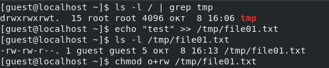{ #fig:010 width=70% height=70% }

- Первоначально все группы имели право на чтение, а запись могли осуществлять все, кроме "остальных пользователей"

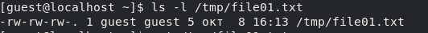{ #fig:011 width=70% height=70% }

4. От пользователя (не являющегося владельцем) попробовал прочитать файл /file01.txt

5. От пользователя попробовал записал в файл test и test2 и проверил командой cat /tmp/file01.txt

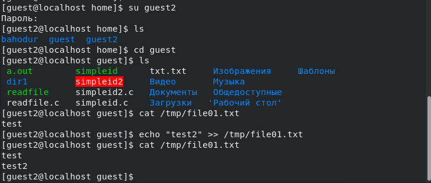{ #fig:012 width=70% height=70% }

- И убеждаемся, что в файле действительно есть наши записанные слова.

6. От пользователя попробовал записать в файл слово test3, стерев при этом всю имеющуюся в файле информацию. И  командой echo "test3" >> /tmp/file01.txt записал новую информацию в файл

7. Также проверил информацию, которая лежит в файле командой cat /tmp/file01.txt

8. От пользователя попробовал удалить файл, и получил отказ

9. От имени суперпользователя выполнил команду, снимающую атрибут t с директории /tmp и покинул режим суперпользователя

10. Повторил предыдущие шаги и мне удалось удалить файл

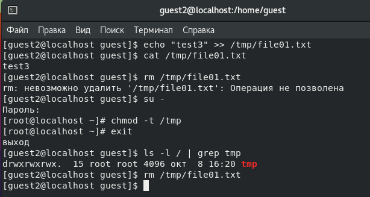{ #fig:013 width=70% height=70% }

# Вывод 

 - Изучил механизмы изменение идентификаторов, применения SetUID- и Sticky-битов. Получил практические навыки работы в консоли с дополнительными атрибутами. Также рассмотрел работу механизма смены идентификатора процессов пользователей и влияние бита на запись и удаление файлов.