---
# Front matter
title: "Отчёт лабораторной работы 6"
subtitle: "Мандатное разграничение прав в Linux"
author: "Турсунов Баходурхон Азимджонович"

# Generic otions
lang: ru-RU
toc-title: "Содержание"

# Bibliography
bibliography: bib/cite.bib
csl: pandoc/csl/gost-r-7-0-5-2008-numeric.csl

# Pdf output format
toc: true # Table of contents
toc_depth: 2
lof: true # List of figures
lot: true # List of tables
fontsize: 12pt
linestretch: 1.5
papersize: a4
documentclass: scrreprt
## I18n
polyglossia-lang:
  name: russian
  options:
	- spelling=modern
	- babelshorthands=true
polyglossia-otherlangs:
  name: english
### Fonts
mainfont: PT Serif
romanfont: PT Serif
sansfont: PT Sans
monofont: PT Mono
mainfontoptions: Ligatures=TeX
romanfontoptions: Ligatures=TeX
sansfontoptions: Ligatures=TeX,Scale=MatchLowercase
monofontoptions: Scale=MatchLowercase,Scale=0.9
## Biblatex
biblatex: true
biblio-style: "gost-numeric"
biblatexoptions:
  - parentracker=true
  - backend=biber
  - hyperref=auto
  - language=auto
  - autolang=other*
  - citestyle=gost-numeric
## Misc options
indent: true
header-includes:
  - \linepenalty=10 # the penalty added to the badness of each line within a paragraph (no associated penalty node) Increasing the value makes tex try to have fewer lines in the paragraph.
  - \interlinepenalty=0 # value of the penalty (node) added after each line of a paragraph.
  - \hyphenpenalty=50 # the penalty for line breaking at an automatically inserted hyphen
  - \exhyphenpenalty=50 # the penalty for line breaking at an explicit hyphen
  - \binoppenalty=700 # the penalty for breaking a line at a binary operator
  - \relpenalty=500 # the penalty for breaking a line at a relation
  - \clubpenalty=150 # extra penalty for breaking after first line of a paragraph
  - \widowpenalty=150 # extra penalty for breaking before last line of a paragraph
  - \displaywidowpenalty=50 # extra penalty for breaking before last line before a display math
  - \brokenpenalty=100 # extra penalty for page breaking after a hyphenated line
  - \predisplaypenalty=10000 # penalty for breaking before a display
  - \postdisplaypenalty=0 # penalty for breaking after a display
  - \floatingpenalty = 20000 # penalty for splitting an insertion (can only be split footnote in standard LaTeX)
  - \raggedbottom # or \flushbottom
  - \usepackage{float} # keep figures where there are in the text
  - \floatplacement{figure}{H} # keep figures where there are in the text
---

# Цель работы 

 - Развить навыки администрирования OC Linux. Получить первое практическое знакомство с технологией SELinux. Проверить работу SELinux на практике совместно с веб-сервесом Apache.

# Выполнение лабораторной работы

## Подготовка

1. Установил httpd

2. Задал имя сервера

3. Открыл порты для работы с протоколом http

## Изучение механики SetUID

1. Вошел в систему с полученными учётными данными и убедился, что SELinux работает в режиме enforcing политики targeted с помощью команд getenforce и sestatus. 

2. Обратился с помощью браузера к веб-серверу, запущенному на моем компьютере и убедился, что последний работает.

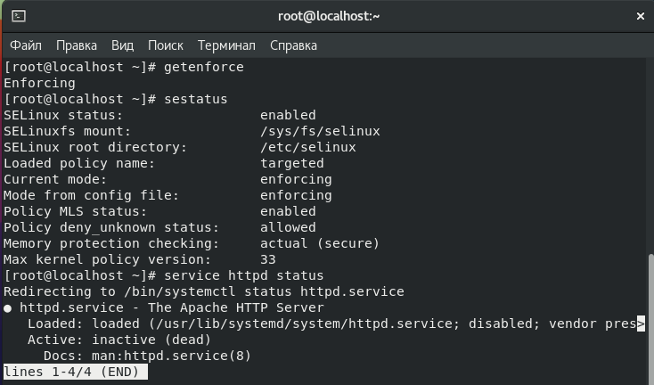{ #fig:001 width=70% height=70%}

<!-- 2. В конфигурационном файле задал параметр ServerName ServerName test.ru, чтобы при запуске веб-сервера не выдавались лишние сообщения об ошибках, не относящихся к лабораторной работе.

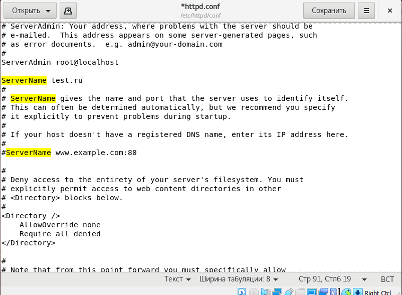{ #fig:002 width=70% height=70%} -->

3. Нашел веб-сервер Apache в списке процессов, определил его контекст безопасности.

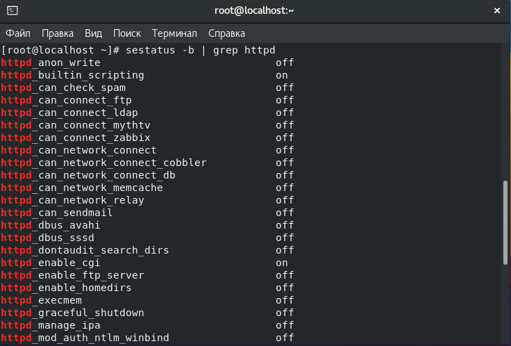{ #fig:002 width=70% height=70%}

4. Определил тип файлов и поддиректорий, находящихся в директории /var/www с помощью команды ls -lZ /var/www

5. Определил тип файлов, находящихся в директории /var/www/html с помощью команды ls -lZ /var/www/html

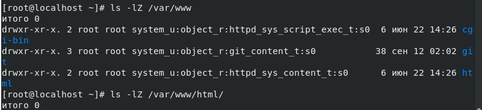{ #fig:003 width=70% height=70%}

6. Создал от имени суперпользователя html-файл 

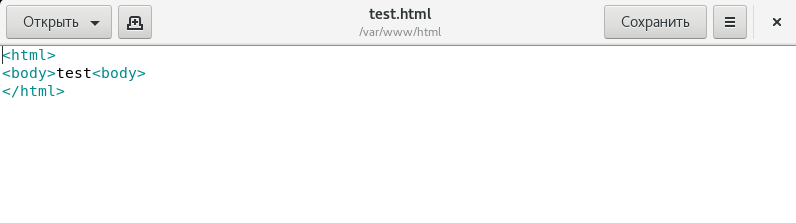{ #fig:004 width=70% height=70%}

7. Открыв файл с помощью Chrome видим наш текст

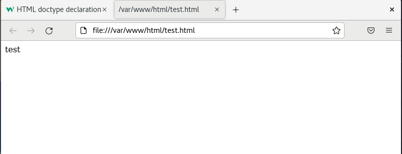{ #fig:005 width=70% height=70%}

8. Обратившись к файлу через веб-сервер введя в браузере нужный адрес, получил ошибку.

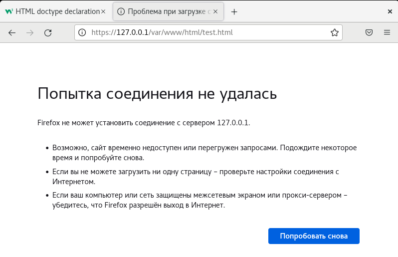{ #fig:006 width=70% height=70%}

9. Изучил справку man httpd_selinux 

10. Изменил контекст файла с httpd_sys_content_t на samba_share_t

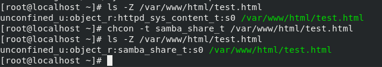{ #fig:007 width=70% height=70%}

11. Снова попробовал доступ к файлу через веб-сервер и снова не получилось.

12. Просмотрел log-файлы веб-сервера Apache. Система предупреждает что она работает очень медленно.

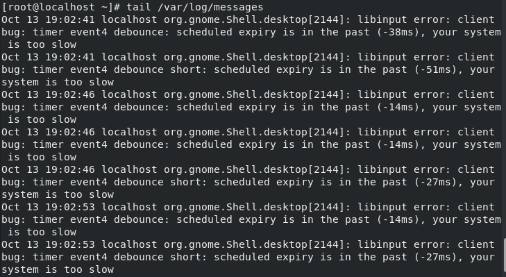{ #fig:008 width=70% height=70%}

13. Попробовал запустить веб-сервер Apache на прослушивание TCP-порта 81. И для этого в файле /etc/httpd/conf/httpd.conf нашел строчку Listen 80 и заменил ее на Listen 81.

14. Выполнил команду semanage port -a -t http_port_t -p tcp 81, и после этого проверил список портов командой semanage port -l | grep http_port_t и убедился, что порт 81 появился в списке.

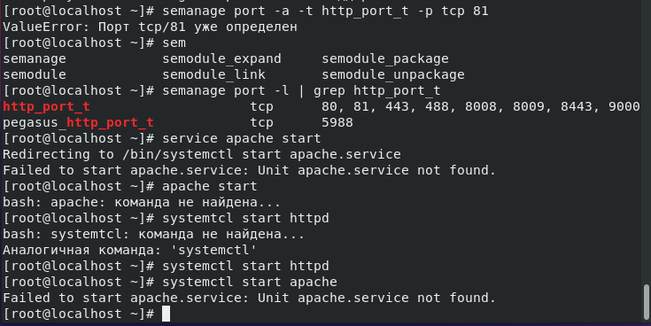{ #fig:009 width=70% height=70%}

15. Вернул контекст httpd_sys_cоntent__t к файлу /var/www/html/ test.html командой chcon -t httpd_sys_content_t /var/www/html/test.html. После этого попробовал получить доступ к файлу через веб-сервер, введя в браузере адрес http://127.0.0.1:81/test.html. и все равно получил ошибку

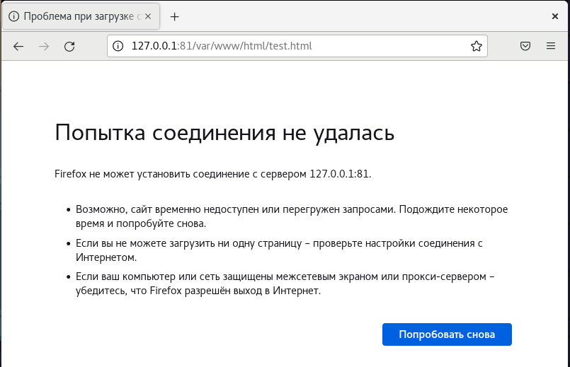{ #fig:010 width=70% height=70%}

16. Удалил файл /var/www/html/test.html командой rm /var/www/html/test.html

# Вывод

В процессе выполнения лабораторной работы были получены базовые навыки работы с технологией SELinux. 